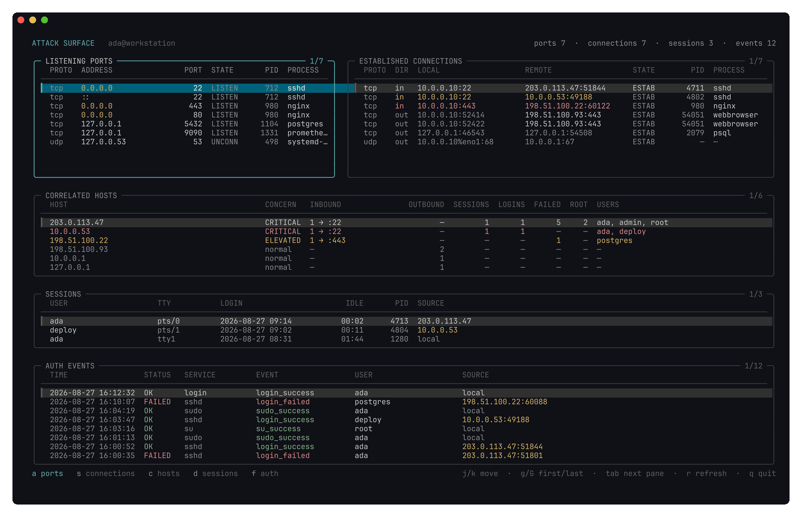

# argus

[](https://github.com/volknichtx/argus/actions/workflows/ci.yml)

Live attack-surface monitor for Linux that correlates listening ports, established
connections, login sessions and authentication events **per remote host** — and
grades each host by how much attention it deserves.

`ss` shows you sockets. `who` shows you sessions. `journalctl` shows you logins.
None of them shows you that the address holding a session on `:22` is the same one
that authenticated four minutes ago. That correlation is what argus is for.



*Synthetic data — the hosts above are documentation addresses, not observed traffic.*

## What it does

Four collectors feed one correlation engine:

| Source | Command | What it contributes |
| --- | --- | --- |
| Listening ports | `ss -H -lntup` | the attack surface itself, and which sockets count as inbound |
| Connections | `ss -H -tunp` | who is talking to this machine, and in which direction |
| Sessions | `who -u` | who is logged in and from where |
| Auth events | `journalctl` | logins, failures and privilege changes |

The session collector also asks `loginctl list-sessions` for the logind id
behind each TTY. That id is what links a privilege change back to the login it
happened inside — see [Privilege escalation](#privilege-escalation).

Everything is joined on the **normalised remote IP**, so `192.0.2.10%eth0`,
`192.0.2.10` and an already-parsed address all land on one host.

The journal request is restricted to the authentication services — `sshd`,
`sshd-session`, `sshd-auth`, `sudo`, `su` and `login` — matched on either
`SYSLOG_IDENTIFIER` or `_COMM`. Without that filter the opening window is filled
with whatever the machine logged last rather than with authentication, and every
poll afterwards parses the entire journal delta only to discard almost all of it.

### Privilege escalation

`su` and `sudo` write no source address. Somebody who logs in over ssh and
becomes root produces two unrelated-looking entries: an sshd line carrying the
address, and an `su_success` line carrying nothing but the account. On an IP
join the second one is anonymous, which is exactly backwards — becoming root is
the more interesting half.

What the privilege change *does* carry is `_AUDIT_SESSION`, the login session it
ran inside. sshd does not log that field, so the two cannot be joined directly;
`loginctl` closes the gap by naming the TTY each session id belongs to, and `who
-u` already ties that TTY to an origin:

```
su_success  _AUDIT_SESSION=5  →  loginctl: session 5 is pts/3  →  who: pts/3 from 192.0.2.45
```

The host row then reports it in its own **ROOT** column, separate from LOGINS —
one ssh login that ran `sudo` twice is one login, not three.

The link is dropped, not guessed, whenever any step is uncertain: no session id,
an id naming a session that has already ended, two sessions claiming one id, a
console login with no remote origin, or a session recorded as a hostname. An
unattributed escalation still shows in the auth pane; a *misattributed* one
would accuse the wrong host.

### Concern levels

Most hosts are boring — a browser talking HTTPS to the internet is not an
incident. A host earns attention when signals combine:

- **critical** — authenticated successfully, escalated to root, or produced a
  cluster of three or more failed authentications.
- **elevated** — reached a listener, or holds an active session.
- **normal** — outbound-only, local, everything else.

A successful authentication is critical on its own, without a live connection to
go with it. The connection and the session both end long before the auth window
does, and a break-in whose session has since closed is not less interesting than
one still open — it used to decay back to normal, which ranked a successful
intrusion below three mistyped passwords.

A failed authentication does not close the access chain, however alarming it
looks in isolation: a failed ssh login always rides on an established connection
to the listener it failed against, so treating single failures as an access
chain would make every mistyped password critical. Three of them are a cluster
and count.

A failed `su` or `sudo` from a linked session counts toward that host's failure
cluster like any other failure — it is an authentication that host attempted and
did not pass.

Loopback is never graded above normal. An adversary who already holds local access
is past everything this tool watches, and grading localhost would bury real
findings under your own `sudo` calls.

Within one level, a peer from the public internet is ordered ahead of one from
the local network. The levels themselves deliberately do not care: lateral
movement, a compromised IoT device and a neighbour on the Wi-Fi all arrive from
a private address, and "reached a listener and got in" is the same threat
whichever side of the router it came from.

### Direction matters

A connection is **inbound** when its local protocol and port are ones this
machine listens on. That distinction is what separates ordinary outbound browsing
from something reaching your SSH port — without it, nearly every row on a
workstation would look alarming and the one row that matters would disappear in
the noise.

## Install

```sh
go install github.com/volknichtx/argus@latest
```

Or build from source:

```sh
git clone https://github.com/volknichtx/argus.git
cd argus
go build -o argus .
```

## Requirements

- Linux with systemd (`journalctl` for auth events, `loginctl` for session ids)
- `ss` from `iproute2`
- `who` from `coreutils`
- Go 1.26 or newer to build

`loginctl` is optional. Without it — or on systemd older than 249, where
`list-sessions --json` does not exist — everything else works and privilege
changes simply stay unattributed rather than being guessed at.

Run it as your normal user. Two things need more than that:

- Process names and PIDs for sockets owned by other users only appear when
  running as root.
- Reading authentication events from journald needs permission to do so. On most
  distributions that means membership in `systemd-journal`, `adm` or `wheel` —
  without it journald simply returns nothing and the auth pane stays empty.

## Keys

| Key | Action |
| --- | --- |
| `a` `s` `c` `d` `f` | focus ports / connections / hosts / sessions / auth |
| `tab` `shift+tab` | cycle panes |
| `h` `l` · `←` `→` | cycle panes |
| `j` `k` · `↓` `↑` | move the cursor |
| `ctrl+d` `ctrl+u` · `pgdn` `pgup` | move half a screen |
| `g` `G` · `home` `end` | first / last row |
| `r` | refresh now |
| `q` · `esc` · `ctrl+c` | quit |

The dashboard refreshes every two seconds on its own; `r` only forces an early
poll. All four collectors together take roughly 30 ms, so the loop costs about
one percent of a core.

The layout adapts to the terminal: below 112 columns or 27 rows it shows the
focused pane full screen instead of the full grid, and it always fits the screen
exactly — no pane reserves height it does not need. Below 64 columns or 16 rows
it says so rather than rendering a mangled dashboard.

The auth pane lists newest first. journald hands its entries over oldest first
and the retention cap trims from that end, so rendering them in arrival order
put the newest event below the fold of a full pane — the one event a live
monitor exists to show.

## Diagnostics

The collectors skip input they cannot parse rather than failing a whole poll: one
unreadable row would otherwise cost you every other row in that pane. Skipped
input is reported through a log that is **discarded by default**, because
anything written to the terminal while the dashboard owns it lands in the middle
of a frame.

Set `ARGUS_LOG` to collect it:

```sh
ARGUS_LOG=~/argus.log argus
```

The file is created mode `0600`. It records which addresses reached this machine,
so it is not something to leave world-readable.

## Design

Three rules the code sticks to:

1. **The engine is pure.** `correlation.Correlate(ports, conns, sessions, auth)`
   is a function of its inputs with no I/O and no UI. A wrong answer is a bug in
   there and is fixed there, never in the rendering layer.
2. **The view is a projection.** Panes render what the engine returns; they never
   compute their own opinion about the data. Where the view does need a
   cross-pane fact — what counts as inbound — it calls the engine rather than
   keeping a second, drifting notion of it.
3. **Never fabricate a finding.** Where a link is ambiguous it is dropped rather
   than guessed. A missed finding is recoverable; a fabricated "you were
   compromised" destroys trust in every other row.

Slow work runs as a Bubble Tea command, so no goroutine ever touches the model:
collectors return messages, and only `Update` writes state.

## Testing

```sh
go test ./...
go test ./... -coverprofile=cover.out && go tool cover -func=cover.out
```

The collectors are tested against recorded `ss` output in `collect/testdata/` and
against a fake `ss`/`who`/`journalctl` that replays fixed output, so the suite
does not depend on what the machine running it happens to be doing.

CI runs on every push to `main` and every pull request: `gofmt`, `go vet`, the
suite under `-race`, a coverage floor of 80%, and `govulncheck`. Every action is pinned
to the commit its release tag pointed at rather than to a moving tag, and the
scanner to a released version rather than `@latest` — a supply chain this tool
is meant to watch is not one to leave floating.

No address anywhere in this repository points at real infrastructure. Routable
examples come from the ranges reserved for documentation — RFC 5737
(`192.0.2.0/24`, `198.51.100.0/24`, `203.0.113.0/24`) and RFC 3849
(`2001:db8::/32`). The rest are addresses that are non-routable by definition:
RFC 1918 private space where the example is specifically about a LAN peer, plus
loopback and link-local.

## Status

Working and useful, but young. Known limits:

- **A privilege change outlives the session it ran in.** The escalation join
  follows a live `loginctl` session; once that session ends there is nothing left
  to resolve its id against, and the event drops back to unattributed in the auth
  pane. Escalations are linked while the login is open, not retroactively.
- **Direction detection uses the listener set, not TCP state.** An outbound
  connection whose ephemeral source port happens to match a listening port of the
  same protocol reads as inbound.
- **A session recorded as a hostname drops out of the join.** sshd with `UseDNS`
  enabled, or `who --lookup`, records a name rather than an address. Resolving it
  back would mean DNS I/O, which a pure engine must not do.
- **Only journald is implemented as an auth source.** `/var/log/auth.log` and
  `/var/log/secure` are detected and reported as unsupported, not parsed. See
  [Roadmap](#auth-sources-other-than-journald).

## Roadmap

Nothing here is promised, and the order is roughly the order of usefulness.

### Auth sources other than journald

journald is the only source implemented; the fallback files are detected and
refused rather than parsed. Three files tend to get conflated under "the auth
log", and they are not the same problem:

| File | Where | Format |
| --- | --- | --- |
| `/var/log/auth.log` | Debian, Ubuntu | syslog text — the same sshd/sudo/su messages already parsed |
| `/var/log/secure` | RHEL, Fedora, SUSE | syslog text, the same messages again |
| `/var/log/audit/audit.log` | auditd, any distribution | `type=USER_AUTH msg=audit(…)` key/value records |

The first two are mostly plumbing. `parseAuthMessage` already understands what
those lines say, so what is missing is a reader that follows a file, survives
rotation, and hands the parsers a line and a timestamp. That is the near-term
work, and it is what lets argus run on a machine without systemd at all.

auditd is a different parser and the bigger prize. Its records carry the audit
login uid and session id as fields of their own, and they stay in the log after
the session ends — which is exactly what the escalation join lacks today, since
it resolves session ids against a live `loginctl` and dies with the session.
Reading auditd would make an escalation attributable long after the login that
opened it closed, turning the first known limit above from a constraint into
something that simply got fixed.

### macOS

Long-term, and worth being precise about what it touches.

`correlation`, `model` and `tui` are already platform-neutral — the engine is a
pure function over four slices and names no Linux tool anywhere. Only `collect`
is Linux-specific, and only because it shells out to Linux commands. So this is
a second collector behind the same types, chosen by build tag, rather than a
rewrite. If the port turns out to need changes outside `collect`, that is a
signal the boundary leaked and the fix belongs there, not in the port.

| Linux | macOS | State |
| --- | --- | --- |
| `ss -H -lntup` / `-tunp` | `lsof -i -P -n` | mechanical; `netstat -an` also works but loses process names |
| `who -u` | `who` | close enough that most of the parser survives |
| `journalctl -o json` | `log show --style json` | different query language, same shape of answer |
| `loginctl list-sessions` | no equivalent | the open question |

That last row is why this is long-term rather than next. macOS has audit session
ids of its own, but reaching them means OpenBSM records under `/var/audit/` read
through `praudit`, not a command that hands back JSON. Until that is solved a
macOS build would ship without the escalation join — still worth having, but
worth saying in advance rather than discovering after the port.

## License

MIT — see [LICENSE](LICENSE).
